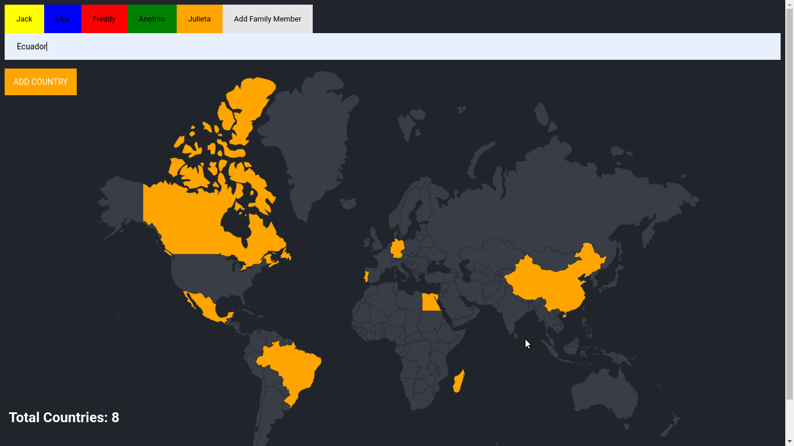

# Practice: Visited countries tracker

This project aims to illustrate some basic and crucial aspects about relational databases, in this case, Postgres databases.



# Get started

## Setup the docker compose file

Fill the the correspondong fields in `dcoker-compose.yml` in order to setup the Docker container.

## Inicialize Docker instance for postgres and pgadmin

```bash
docker compose up -d
```

## Connect to the database:

Access to the Docker's container and open a bash session:

```bash
docker compose exec -it <container_name> bash

```

Connect to Postgres database:

```bash
psql -h <hostname or ip address> -p <port number of remote machine> -d <database> -U <username>
```

## Create tables

Database connection using psql.

In order to set up a database for this app, you are going to create some tables:

**Countries table**

```sql
 CREATE TABLE countries (
  id SERIAL PRIMARY KEY,
  country_code VARCHAR(10),
  country_name VARCHAR(255)
);
```

**Users table**

```sql
CREATE TABLE users(
id SERIAL PRIMARY KEY,
name VARCHAR(30) UNIQUE NOT NULL,
color VARCHAR(30)
);
```

**Visited countries table (relation "Many to Many" between countries and users)**

```sql
CREATE TABLE visited_countries (
  user_id INTEGER REFERENCES users(id),
  country_id INTEGER REFERENCES countries(id),
  PRIMARY KEY (user_id, country_id)
);
```

## Insert initial data

```sql
INSERT INTO users (name, color)
VALUES ('Angela', 'teal'), ('Jack', 'powderblue');

INSERT INTO visited_countries (user_id, country_id ) VALUES (1, 12), (1, 20);

```

## Join tables query

```sql
SELECT *
FROM visited_countries
JOIN users
ON users.id = user_id;

SELECT country_code
FROM visited_countries
JOIN countries ON countries.id = visited_countries.country_id
WHERE user_id = 2;
```

## Import initial data from .csv files

Transform the .cvs file into a new table in the database (previous data uploading).

```bash
docker compose exec postgres psql -U <username> -d <database> -c "\copy countries(id, country_code, country_name) FROM '/docker-entrypoint-initdb.d/countries.csv' DELIMITER ',' CSV HEADER;"

docker compose exec postgres psql -U <username> -d <database> -c "\copy users(name, color) FROM '/docker-entrypoint-initdb.d/users.csv' DELIMITER ',' CSV HEADER;"

```

## Run the app

```bash
npm install
npm run dev
```

> SQL IDs: Be careful when you setup ids by yourself. Is better let the system implement the id following some criteria.

# General notes:

**Import data from .csv:**

Include the the corresponding files to docker's config:

```yml
volumes:
  - ./<name_file>.csv:/docker-entrypoint-initdb.d/<name_file>.csv
```

Connect to the database.

Create the corresponding data. Make sure that the fields match:

```sql
 CREATE TABLE countries (
  id SERIAL PRIMARY KEY,
  country_code VARCHAR(10),
  country_name VARCHAR(255)
);

```

Transform the .cvs file into a new table in the database.

```bash

docker compose exec postgres psql -U <username> -d <database> -c "\copy <table>([fields]) FROM '/docker-entrypoint-initdb.d/<file>.csv' DELIMITER ',' CSV HEADER;"

```

Thanks [Angela Yu](https://x.com/yu_angela).
